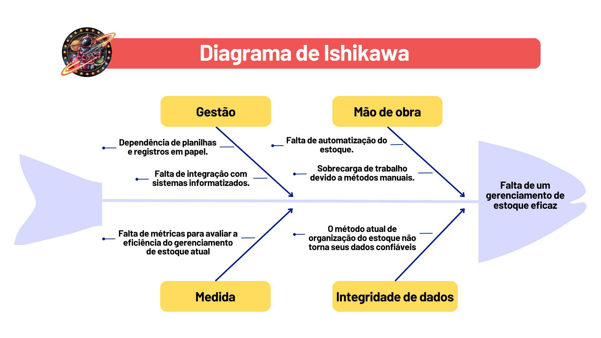
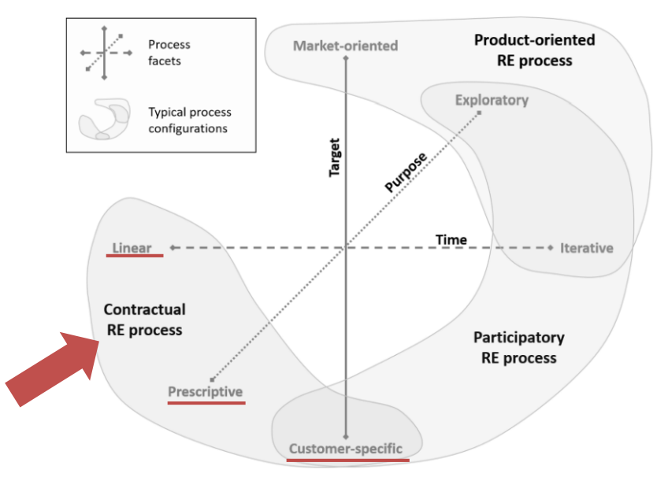
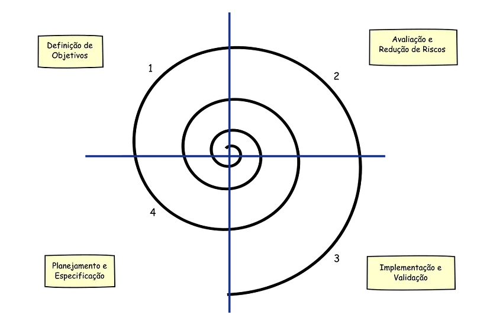

**Histórico de Revisão**

| **Data**   | **Versão** | **Descrição**                                                                         | **Autor**                                                                 |
| ---------- | ---------- | ------------------------------------------------------------------------------------- | ------------------------------------------------------------------------- |
| 08/04/2024 | 1\.0 | Criação do documento | Carlos Eduardo; Eric Rabelo;  Paulo Henrique; Samara Letícia; Sunamita Vitória;  Wolfgang Stein |
| 16/04/2024 | 2\.0 | Preenchendo seções de visão geral do projeto e de lições aprendidas| Eric Rabelo;  Paulo Henrique; Wolfgang Stein |
| 17/04/2024 | 2\.1 | Criação do Gerenciamento de Riscos e planejamento das fases e/ou Iterações do Projeto, critérios de replanejamento, lições aprendidas e material sobre processos ESW | Carlos Eduardo; Júlia Takaki; Samara Letícia, Paulo Henrique, Suanmita Vitória, Eric Rabelo| Wolfgang  Stein |
| 28/04/2024 | 2\.2 | Corrigindo o Processo de Desenvolvimento de Software | Paulo Henrique |
| 29/04/2024 | 2\.3 | Corrigindo o tópico "1.1 Problema" | Carlos Eduardo Rodrigues |

## 1. **Visão do Produto e Projeto**

### 1.1 **Problema**

Foi identificado que o cliente está utilizando planilhas e, por vezes, até papel para realizar o gerenciamento de estoque de sua empresa. O método atual é propenso a erros, tais como duplicação e perda de dados, além de demandar um tempo significativo para atualização. O uso de planilhas e anotações em papel dificulta o rastreamento do histórico de movimentação de estoque, como entradas e saídas, dificultando a elaboração de relatórios, análises e identificação de tendências ou problemas.

  
{width=1000}

 Imagem 1 - Diagrama de Ishikawa 

### 1.2 **Declaração de Posição do Produto**

O produto proposto se trata de um Aplicativo Desktop que visa resolver o problema de gestão de estoque da loja de materiais de construção "Construmix". Atualmente, o cliente utiliza planilhas excel e anotações físicas para fazer o controle do estoque da loja, o que demanda muito tempo e esforço. O público alvo do DataMix são os funcionários da loja de construção Construmix que utilizarão a plataforma para simplificar e agilizar o gerenciamento de estoque de produtos e materiais.

A solução proposta visa eliminar a necessidade de utilizar planilhas Excel, oferecendo funcionalidades para acompanhar o fluxo de entrada e saída de itens, verificar disponibilidade de produtos e realizar o cadastro de itens. Ao automatizar esses processos, o DataMix economiza tempo e esforço para os funcionários da Construmix, minimizando erros humanos e otimizando a eficiência operacional da loja. 

Tabela 1 - Declaração de Posição do Produto

| |Descrição                                                                                                                                                                    |
| -------------- | :-------------------------------------------------------------------------------------------------------------------------------------------------------------------------------- |
| Para:    | Loja de material de construção "Construmix".                                                                                                                                                         |
| Quem:          | Equipe DataDiggers.                                                                                                                                                               |
| O DataMix:    | É um aplicativo desktop.                                                                                                                                                       |
| Que:           | Gerencia o estoque da loja de contrução Construmix.                                                                                                                                     |
| Ao contrário:  | De fazer o controle de estoque através de anotações físicas e planilhas.                                                                                                                     |
| Nosso produto: |  Oferece funcionalidades para acompanhar o fluxo de entrada e saída de itens, verificar disponibilidade de produtos e realizar o cadastro de itens. |

### 1.3 **Objetivos do Produto**

Auxiliar na organização de estoque de produtos e controle de fluxo de caixa da loja de materiais de construção CONSTRUMIX.

### 1.4 **Tecnologias a Serem Utilizadas**

- **GitHub**: Utilizado para gerenciamento de código-fonte, controle de versão e colaboração entre a equipe.
- **Visual Studio Code**: Usado para desenvolver o projeto.
- **Discord**: Uma plataforma de comunicação e colaboração que auxilia na comunicação da equipe e reuniões virtuais.
- **Google Meet**: Uma plataforma de comunicação utilizada pra contatar o cliente.
- **WhatsApp**: Plataforma de mensagens utilizada para comunicação diária entre os integrantes da equipe.

## 2. **Visão Geral do Projeto**

### 2.1 **Organização do Projeto**

Tabela 2 – Tabela de Organização

|**_Papel_**|**_Atribuições_**|**_Responsavel_**|**_Participantes_**|
|-|-|-|-|
|Desenvolvedor|Codificação do produto, colaboração em equipe, aplicação de práticas técnicas e compromisso com os objetivos do produto.|_Eric_|
Samara
 
Sunamita
|
|Scrum Master|Facilitador do processo ágil de desenvolvimento de software, garantindo que a equipe compreenda e siga os princípios do Scrum|_Paulo_|
Julia
 
Carlos
|
|Dono do Produto|Atualizar o escopo do produto, organizar o escopo das sprints, validar as entregas|_Wolfgang_|
Eric
 
Paulo
|
|Cliente|Fornecimento de requisitos e validação da aplicação.|--|--|

### 2.2 **Planejamento das Fases e/ou Iterações do Projeto**

Tabela 3 – Planejamento e Sprint

| **_Sprint_**|**_Produto (entrega)_**|**_Data Inicio_**|**_Data Fim_** |**_Entregaveis_** |**_Responsáveis_**|**_Conclusão_**|
|-|-|-|-|-|-|-|
|Sprint 0 | Definição do projeto.| 01/04| 08/04 | Escolha do tema e definição do escopo do projeto.| TODOS | 100% |
|Sprint 1 |Revisão dos fundamentos de Engenharia de Software. |08/04 |15/04 | Apresentação sobre os processos e fundamentos de engenharia de software |TODOS | 100% |
|Sprint 2 | Definição do processo de ER.|15/04 |22/04 | Visão do produto e projeto |TODOS | |
|Sprint 3 |Elaboração do backlog do produto. |22/04 |29/04 | SAFe e User Story.|TODOS | |
|Sprint 4 | Definição do MVP.|29/04 |06/05 | Documento de escopo do MVP |TODOS | |
|Sprint 5 |Refinamento do backlog. |06/05 |13/05 |Definição de critérios de aceitação. |TODOS | |
|Sprint 6 | User Story Mapping.|13/05 |20/05 |Protótipo de telas. |TODOS | |
|Sprint 7 | Modelagem de casos de uso.|20/05 |27/05 | Diagrama de casos de uso |TODOS | |
|Sprint 8 | Desenvolvimento do MVP.|27/05 |03/06 | Protótipos do MVP |TODOS | |
|Sprint 9 |Desenvolvimento do MVP. |03/06 |10/06 |Deploy |TODOS | |
|Sprint 10 |Testes de aceitação. |10/06 |17/06 | Planos de teste e casos de teste |TODOS | |
|Sprint 11 |Correções e ajustes finais no software. |17/06 |24/06 | Escopo final |TODOS | |
|Sprint 12 |Preparação final para entrega do projeto.|24/06 |01/07 | Software final |TODOS | |

### 2.3 **Matriz de Comunicação**

Tabela 4 – Comunicação do grupo

| Descrição                                                               | Área/Envolvidos | Periodicidade | Produtos Gerados                   |
| ----------------------------------------------------------------------- | --------------- | ------------- | ---------------------------------- |
|Acompanhamento das Atividades em Andamento (Daily)                       |Equipe           |Diário         |Relatório de situação do projeto    |
|Planejamento e divisão de tarefas da sprint (Planning)                   |Equipe           |Semanal        |Ata de reunião                      |
|Encerramento e revisão da sprint (Review)                                |Equipe           |Semanal        |Ata de reunião                      |
|Comunicação da situação do projeto                                       |Monitor          |Semanal        |Relatório de situação do projeto    |

### 2.4 **Gerenciamento de Riscos**

Tabela 5 – Gerenciamento de Riscos

| Risco                                                     | Consequência                                                | Estratégia | Resposta                                                    |
| -------------------------------------------------------------------------------------------------------- | -------------------------------------------------------------------------------------------------------- | --------------- | --------------------------------------------------------------------------------------- |
| Desistência da Disciplina | Ter um integrante a menos no grupo significa que os outros integrantes vão ter que trabalhar mais para suprir as atividades daquele integrante. | Mitigar | Manter boa comunicação no time e oferecer ajuda para a disciplina quando um dos membros precisar, para evitar que ele saia da disciplina. |
| Falta de Comunicação com StakeHolders | A falta de comunicação com o Stakeholder pode gerar mal entendidos, na insatisfação do Stakeholder e no desalinhamento do projeto. | Evitar | Realizar reuniões periodicamente com o Stakeholder para que ele esteja ciente de tudo que está se passando no projeto. |
| Conciliar horários | Um mal gerenciamento de horários pode prejudicar o desempenho dos membros em outras matérias da faculdade ou em outros compromissos que eles tenham. | Mitigar | Planejamento antecipado das tarefas, ter prazos bem estabelecidos, respeitar os horários de estudo e de dedicação a disciplina. |
| Escopo do projeto mal definido ou em constante mudança. | Pode acarretar no desalinhamento do projeto, e prejudicar o resultado final do projeto. | Mitigar | Realizar uma análise detalhada dos requisitos do projeto antes do início do desenvolvimento. Utilizar metodologias ágeis que permitam a adaptação a mudanças nos requisitos ao longo do tempo. |
| Subestimação de prazos e recursos. | O mal planejamento de prazos, entregar e recursos pode gerar uma sobrecarga de trabalho em um curto prazo de tempo. | Evitar | Trabalhar respeitando os prazos estabelecidos da disciplina. |

### 2.5 **Critérios de Replanejamento**

 - Desvios Significativos de Cronograma: Se o projeto estiver significativamente atrás do cronograma planejado, pode ser necessário replanejar para ajustar as datas de entrega, revisar as dependências entre as tarefas e realocar recursos para recuperar o tempo perdido.

 - Mudanças nos Requisitos ou Escopo: Se houver mudanças significativas nos requisitos do projeto ou no escopo do trabalho, pode ser necessário replanejar para acomodar essas alterações. Isso pode envolver ajustes nos prazos, recursos e custos do projeto.

 - Riscos Emergentes: Se novos riscos surgirem durante a execução do projeto que não foram previstos no plano original, pode ser necessário replanejar para mitigar esses riscos. Isso pode incluir a implementação de novas estratégias de mitigação de riscos ou a realocação de recursos para lidar com os riscos identificados.

 - Mudanças nos Recursos Disponíveis: Se houver mudanças nos recursos disponíveis para o projeto, como restrições orçamentárias ou indisponibilidade de recursos-chave, pode ser necessário replanejar para ajustar o escopo, cronograma e alocação de recursos do projeto.

 - Feedback das Partes Interessadas: Se as partes interessadas fornecerem feedback significativo durante a execução do projeto que indique a necessidade de ajustes no plano, pode ser necessário replanejar para incorporar esse feedback e garantir a satisfação das partes interessadas.

 - Desempenho do Projeto: Se o desempenho do projeto não atender às expectativas em termos de qualidade, custo ou prazo, pode ser necessário replanejar para identificar e corrigir quaisquer deficiências no plano original e melhorar o desempenho geral do projeto.

## 3.0 **Processo de Desenvolvimento de Software**

### **Metodologias**

Tabela 6 – Metodologias

|Abordagem        |Ciclo de vida           |Processo  de desenvolvimento |
|-----------------|------------------------|-----------------------------|
|Dirigida a plano |Iterativo e Incremental |Espiral                      |

No processo de desenvolvimento de um produto de software, é de suma importância ter em mente que o êxito do projeto não se restringe a apenas codificação, sendo essencial identificar as características produto para haver a possibilidade de definir as metodologias utilizadas ao longo do seu desenvolvimento.

A grande diferença entre uma abordagem dirigida a plano para uma ágil é a limitação que cada projeto possui. Para o CONSTRUMIX, as necessidades definidas pelo cliente culminou na escolha de uma abordagem dirigida a plano, visto que, inicialmente, seus requisitos estão bem definidos e concisos com relação ao desenvolvimento do projeto. 

### **Análise pelo framework Gupta**

Baseado no Framework proposto por Gupta para a escolha dos processos, respondemos uma série de questões sobre os tópicos abordados pelo Framework para definir o modelo de desenvolvimento que será utilizado ao longo do projeto.

#### **1. Característica dos Requisitos**

Tabela 7 – Características dos Requisitos

| Pergunta                                                             | Resposta       |
| -------------------------------------------------------------------- | -------------- |
| Os requisitos são fáceis de entender e definir?                      | Sim            |
| Nós mudamos os requisitos com bastante frequência?                   | Não            |
| Nós podemos definir os requisitos ao início de cada ciclo?           | Sim            |
| Os requisitos estão indicando um sistema complexo para se construir? | Não            |

Na conclusão do primeiro modelo de Gupta acerca das características dos requisitos, notamos que o projeto não tem uma complexidade grande na sua construção e que os requisitos são estáveis e bem definidos, além de que não há planos de mudança de requisitos ao longo do projeto.

#### **2. Status da Equipe de Desenvolvimento**

Tabela 8 – Status da Equipe de Desenvolvimento

| Pergunta                                               | Resposta       |
| ------------------------------------------------------ | -------------- |
| Pouca experienca em projetos similares                 | Sim            |
| Pouca experiência em tecnologias similares             | Sim            |
| Pouca experiência com as ferramentas que serão usadas? | Não            |
| Disponibilidade para treinamento, se necessário        | Sim            |

Na conclusão do segundo modelo de Gupta acerca do status da equipe de desenvolvimento, os membros da equipe possui pouca experiência em projetos similares e familiaridade com as ferramentas que serão utilizadas, além de que, caso seja necessário, haja o treinamento de uma tecnologia e/ou ferramenta específica.

#### **3. Envolvimento do Usuário**

Tabela 9 – Envolvimento do Usuário

| Pergunta                                                                    | Resposta       |
| --------------------------------------------------------------------------- | -------------- |
| Envolvimento dos usuários                                                   | Não            |
| Participação limitada dos usuários                                          | Não            |
| Usuário não tem experiência anterior em participação em projetos similares? | Sim            |
| Usuário são especialistas no domínio do problema?                           | Sim            |

Na conclusão do terceiro modelo de Gupta acerca do envolvimento do usuário, nosso cliente não conseguirá estar presente em todas as fases de desenvolvimento do projeto e, consequentemente, sua participação será limitada. Porém, o cliente possuí domínio sobre o problema a ser resolvido, podendo ajudar, mesmo que pouco, no desenvolvimento do produto.

#### **4. Tipo de Projeto e Risco Associado**

Tabela 10 – Tipo de Projeto e Risco Associado

| Pergunta                                                   | Nossa resposta |
| ---------------------------------------------------------- | -------------- |
| O projeto é melhoria de um sistema existente?              | Não            |
| O financiamento está estável para o projeto?               | Não            |
| Requisitos de alta confiabilidade?                         | Sim            |
| Cronograma do projeto é apertado?                          | Sim            |
| Uso de componentes reutilizáveis?                          | Não            |
| Os recursos (Tempo, dinheiro, pessoas etc) estão escassos? | Sim            |

Concluindo o quarto e último modelo de Gupta acerca do tipo de projeto e risco associado, temos que o projeto será uma aplicação nova em que os requisitos passam uma boa confiança para desenvolver. Porém, é necessário fazer uma gestão eficiente do tempo, visto que seu cronograma é apertado e os recursos são escassos.

Com base nas perguntas feitas em cada tópico, decidimos por escolher o processo de desenvolvimento Espiral, visto que, à priori, os requisitos do projeto encontram-se bem definido e estáveis para ser utilizado ao longo de todo seu desenvolvimento, utilizando o ciclo de vida iterativo e o contato com o cliente, mesmo que limitado, será de grande ajuda para estruturar o projeto. Entretanto, sendo necessário tomar um certo cuidado com o cronograma e com os possíveis riscos que o projeto poderá gerar.

### **Facetas da Engenharia de Requisitos**

A faceta do processo de engenharia de requisitos que mais se adequa ao projeto e como ele seguirá ao longo do desenvolvimento, será o **Processo Contratual**. Visto que utilizaremos uma abordagem dirigida a plano.

{width=700}

Imagem 2 - Faceta da Engenharia de Requisitos

|Alvo               |Propósito   |Tempo |
|-------------------|------------|------|
|Cliente Específico |Prescritivo |Linear|

Tabela 11 – Faceta da Engenharia de Requisitos

#### **1. Atividades do Processo da Engenharia de Requisitos**

As atividades do processo de engenharia de requisitos são essenciais para garantir que os requisitos do projeto sejam bem definidos, compreendidos e validados. Isso inclui a identificação dos requisitos do cliente, a análise e documentação dos requisitos, a validação dos requisitos com o cliente e a garantia de que os requisitos atendam às necessidades do cliente. 

Tabela 12 – Atividades do Processo de Engenharia de Requisitos

|Etapa                                  | Descrição                                                                                |
|---------------------------------------|------------------------------------------------------------------------------------------|
|Viabilidade                            |Realizar um estudo para validar a pertinência do sistema para a loja.                     |
|Descoberta e Análise de Requisitos     |Conduzir reuniões com as partes interessadas para compreender as necessidades do negócio. |
|Especificação de Requisitos            |Especificar os requisitos do sistema por meio de um modelo, diagrama ou documento escrito.|
|Validação de Requisitos                |Obter feedback do cliente com relação aos requisitos do sistema.                          |

As atividades do processo de engenharia de requisitos serão repetidas várias vezes à medida que o sistema é desenvolvido.

#### **2. Requisitos e Planejamento**

Tabela 13 – Requisitos e Planejamento **(Arrumar essa tabela)**

|Etapa                                  |Método             |Entrega     |
|---------------------------------------|-------------------|------------|
|Elicitação e Descoberta                |                   |            |
|Análise e Consenso                     |                   |            |
|Declaração                             |                   |            |
|Representação                          |                   |            |
|Verificação e Validação                |                   |            |
|Organização e Atualização              |                   |            |

### ***Processo de Desenvolvimento Espiral***

O processo de desenvolvimento em espiral é uma abordagem iterativa e incremental que combina elementos de desenvolvimento em cascata com prototipação. Essa metodologia foi proposta por Barry Boehm em 1986 e tem sido amplamente utilizada na indústria de software. Consiste em ciclos de atividades, onde cada ciclo representa uma iteração. Cada ciclo tem quatro principais fases: determinação de objetivos, análise de riscos, desenvolvimento e planejamento. Essas fases são executadas de forma iterativa, permitindo o refinamento e aprimoramento do software ao longo do processo.

{width=700}

 Imagem 3 - Processo de Desenvolvimento Espiral 

Uma das principais vantagens do desenvolvimento de software em espiral é que ele incorpora a análise de riscos desde o início. Isso permite que os riscos sejam identificados e mitigados de forma proativa, reduzindo a possibilidade de problemas graves no produto final. Além disso, essa abordagem permite a adaptação às mudanças durante o processo de desenvolvimento, garantindo maior flexibilidade.

Tabela 14 – Atividades do Processo de Desenvolvimento Espiral **(Arrumar essa tabela)**

|Nome da Atividade |Método |Ferramenta |Entrega | 
|-|-|-|-|
|Planejamento da Sprint |Seleção de itens do Backlog do Produto, discussões em equipe |GitHub Projects (quadro Kanban) |Backlog da Sprint |
|                   |Definição de objetivos (issues)      | GitHub e Discord / Google Meet (reunião) |Lista de tarefas estimadas |
|Execução da Sprint |Desenvolvimento incremental          |Visual Studio Code             |Incrementos de software |
|                   |Reuniões diárias |WhatsApp / Discord |Progresso diário compartilhado |
|Revisão da Sprint  |Apresentar o que foi concluído     |Discord / Google Meet          |Sprint finalizada e feedback do cliente |
|                   |Revisão do Backlog do Produto |GitHub Projects revisado (quadro Kanban) |Backlog da Sprint revisado |

## 4.0 **Lições Aprendidas**

### 4.1 **Unidade 1**

Durante a realização das atividades da Unidade 1, tivemos pequenos conflitos dentro da equipe por conta da gestão de tempo e prioridades entre os membros. Aprendemos que a comunicação aberta e a definição clara de expectativas são fundamentais para evitar conflitos e garantir que todos estejam alinhados com os objetivos do projeto. Além disso, percebemos a importância de estabelecer metas claras e prazos realistas para garantir que as atividades sejam concluídas dentro do cronograma estabelecido.

Reconhecemos que conflitos inevitavelmente surgirão em uma equipe, mas devemos abordá-los de maneira construtiva e colaborativa. A comunicação aberta e honesta é fundamental para resolver conflitos de forma eficaz e manter um ambiente de trabalho positivo. Isso inclui promover uma cultura de respeito mútuo, abertura para diferentes perspectivas e buscar soluções colaborativas.

Durante a reunião com o cliente, houve um erro na forma que abordamos o cliente, fazendo perguntas que não agregariam no desenvolvimento do projeto adequadamente. Diante destes problemas, aprendemos a ser menos invasivos e mais objetivos nas perguntas, para que o cliente se sinta mais confortável e seguro em responder.

## 5.0 **Referências Bibliográficas**

Audy, Jorge. Scrum 360: Um guia completo e prático de agilidade. São Paulo: Casa do Código, 2015.
