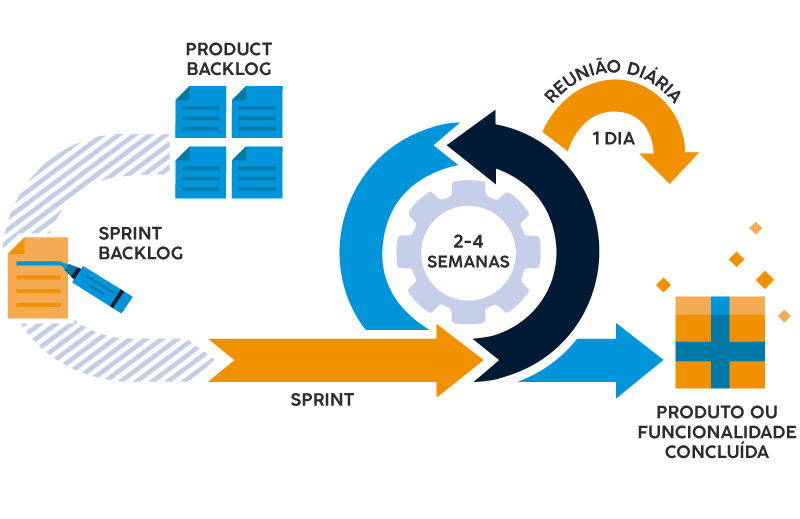

**Histórico de Revisão**

| **Data**   | **Versão** | **Descrição**                                                                         | **Autor**                                                                 |
| ---------- | ---------- | ------------------------------------------------------------------------------------- | ------------------------------------------------------------------------- |
| 08/04/2024 | 1\.0 | Criação do documento | Carlos Eduardo; Eric Rabelo;  Paulo Henrique; Samara Letícia; Sunamita Vitória;  Wolfgang Friedrich |
| 16/04/2024 | 2\.0 | Preenchendo seções de visão geral do projeto e de lições aprendidas| Eric Rabelo;  Paulo Henrique; Wolfgang Friedrich |
| 17/04/2024 | 2\.1 | Criação do Gerenciamento de Riscos e planejamento das fases e/ou Iterações do Projeto, critérios de replanejamento, lições aprendidas e material sobre processos ESW | Carlos Eduardo; Júlia Takaki; Samara Letícia, Paulo Henrique, Sunamita Vitória, Eric Rabelo|

## 1. **Visão do Produto e Projeto**

### 1.1 **Problema**

Foi identificado que o cliente está utilizando planilhas e, por vezes, até papel para realizar o gerenciamento de estoque de sua empresa. O uso de planilhas e registros em papel é propenso a erros, tais como duplicação e perda de dados, além de demandar um tempo significativo para atualização. A falta de um sistema centralizado dificulta o rastreamento do histórico de movimentação de estoque, como entradas e saídas, e também não oferece recursos de geração de relatórios e extratos, o que pode dificultar análises de desempenho do estoque e a identificação de tendências ou problemas.

  
{width=1000}

 Imagem 1 - Diagrama de Ishikawa 

### 1.2 **Declaração de Posição do Produto**

Tabela 1 - Visão do Produto

| Para:          | Construmix.                                                                                                                                                                       |
| -------------- | :-------------------------------------------------------------------------------------------------------------------------------------------------------------------------------- |
| Quem:          | Equipe DataDiggers.                                                                                                                                                               |
| O Data Mix:    | É um app.                                                                                                                                                                         |
| Que:           | Auxilia na organização de estoque do cliente.                                                                                                                                     |
| Ao contrário:  | De ter que fazer o controle de estoque em planilhas de Excel.                                                                                                                     |
| Nosso produto: | Terá uma pegada maior a interação humano computador voltado aos desejos do cliente, de tal forma a satisfazer as suas necessidades de controle, mantendo a integridade dos dados. |

O produto proposto é um App que busca resolver os problemas de gestão de estoque e controle de vendas de uma loja de materiais de construção. Atualmente, o cliente utiliza planilhas excel para fazer o controle do estoque da loja, o que,além de não garantir a integridade dos dados, também consome muito tempo e esforço. O público alvo do DataMix serão os funcionários da loja de construção CONSTRUMIX. Nossa aplicação busca automatizar o controle do estoque dos produtos e fornecer uma informação detalhada do fluxo de caixa da loja.

### 1.3 **Objetivos do Produto**

Auxiliar na organização de estoque de produtos e controle de fluxo de caixa da loja de materiais de construção CONSTRUMIX.

### 1.4 **Tecnologias a Serem Utilizadas**

- **GitHub**: Utilizado para gerenciamento de código-fonte, controle de versão e colaboração entre a equipe.
- **Visual Studio Code**: Usado para desenvolver o projeto.
- **Discord**: Uma plataforma de comunicação e colaboração que auxilia na comunicação da equipe e reuniões virtuais.
- **Google Meet**: Uma plataforma de comunicação utilizada pra contatar o cliente.
- **WhatsApp**: Plataforma de mensagens utilizada para comunicação diária entre os integrantes da equipe.

## 2. **Visão Geral do Projeto**

### 2.1 **Organização do Projeto**

Tabela 2 – Tabela de Organização

|**_Papel_**|**_Atribuições_**|**_Responsavel_**|**_Participantes_**|
|-|-|-|-|
|Desenvolvedor|Codificação do produto, colaboração em equipe, aplicação de práticas técnicas e compromisso com os objetivos do produto.|_Eric_|
Samara
 
Sunamita
|
|Scrum Master|Facilitador do processo ágil de desenvolvimento de software, garantindo que a equipe compreenda e siga os princípios do Scrum|_Paulo_|
Julia
 
Carlos
|
|Dono do Produto|Atualizar o escopo do produto, organizar o escopo das sprints, validar as entregas|_Wolfgang_|
Eric
 
Paulo
|
|Cliente|Fornecimento de requisitos e validação da aplicação.|--|--|

### 2.2 **Planejamento das Fases e/ou Iterações do Projeto**

Tabela 3 – Planejamento e Sprint

| **_Sprint_**|**_Produto (entrega)_**|**_Data Inicio_**|**_Data Fim_** |**_Entregaveis_** |**_Responsáveis_**|**_Conclusão_**|
|-|-|-|-|-|-|-|
|Sprint 0 | Definição do projeto.| 01/04| 08/04 | Escolha do tema e definição do escopo do projeto.| TODOS | 100% |
|Sprint 1 |Revisão dos fundamentos de Engenharia de Software. |08/04 |15/04 | Apresentação sobre os processos e fundamentos de engenharia de software |TODOS | 100% |
|Sprint 2 | Definição do processo de ER.|15/04 |22/04 | Visão do produto e projeto |TODOS | |
|Sprint 3 |Elaboração do backlog do produto. |22/04 |29/04 | SAFe e User Story.|TODOS | |
|Sprint 4 | Definição do MVP.|29/04 |06/05 | Documento de escopo do MVP |TODOS | |
|Sprint 5 |Refinamento do backlog. |06/05 |13/05 |Definição de critérios de aceitação. |TODOS | |
|Sprint 6 | User Story Mapping.|13/05 |20/05 |Protótipo de telas. |TODOS | |
|Sprint 7 | Modelagem de casos de uso.|20/05 |27/05 | Diagrama de casos de uso |TODOS | |
|Sprint 8 | Desenvolvimento do MVP.|27/05 |03/06 | Protótipos do MVP |TODOS | |
|Sprint 9 |Desenvolvimento do MVP. |03/06 |10/06 |Deploy |TODOS | |
|Sprint 10 |Testes de aceitação. |10/06 |17/06 | Planos de teste e casos de teste |TODOS | |
|Sprint 11 |Correções e ajustes finais no software. |17/06 |24/06 | Escopo final |TODOS | |
|Sprint 12 |Preparação final para entrega do projeto.|24/06 |01/07 | Software final |TODOS | |

### 2.3 **Matriz de Comunicação**

Tabela 4 – Comunicação do grupo

| Descrição                                                               | Área/Envolvidos | Periodicidade | Produtos Gerados                   |
| ----------------------------------------------------------------------- | --------------- | ------------- | ---------------------------------- |
|Acompanhamento das Atividades em Andamento (Daily)                       |Equipe           |Diário         |Relatório de situação do projeto    |
|Planejamento e divisão de tarefas da sprint (Planning)                   |Equipe           |Semanal        |Ata de reunião                      |
|Encerramento e revisão da sprint (Review)                                |Equipe           |Semanal        |Ata de reunião                      |
|Comunicação da situação do projeto                                       |Monitor          |Semanal        |Relatório de situação do projeto    |

### 2.4 **Gerenciamento de Riscos**

| Risco                                                     | Consequência                                                | Estratégia | Resposta                                                    |
| -------------------------------------------------------------------------------------------------------- | -------------------------------------------------------------------------------------------------------- | --------------- | --------------------------------------------------------------------------------------- |
| Desistência da Disciplina | Ter um integrante a menos no grupo significa que os outros integrantes vão ter que trabalhar mais para suprir as atividades daquele integrante. | Mitigar | Manter boa comunicação no time e oferecer ajuda para a disciplina quando um dos membros precisar, para evitar que ele saia da disciplina. |
| Falta de Comunicação com StakeHolders | A falta de comunicação com o Stakeholder pode gerar mal entendidos, na insatisfação do Stakeholder e no desalinhamento do projeto. | Evitar | Realizar reuniões periodicamente com o Stakeholder para que ele esteja ciente de tudo que está se passando no projeto. |
| Conciliar horários | Um mal gerenciamento de horários pode prejudicar o desempenho dos membros em outras matérias da faculdade ou em outros compromissos que eles tenham. | Mitigar | Planejamento antecipado das tarefas, ter prazos bem estabelecidos, respeitar os horários de estudo e de dedicação a disciplina. |
| Escopo do projeto mal definido ou em constante mudança. | Pode acarretar no desalinhamento do projeto, e prejudicar o resultado final do projeto. | Mitigar | Realizar uma análise detalhada dos requisitos do projeto antes do início do desenvolvimento. Utilizar metodologias ágeis que permitam a adaptação a mudanças nos requisitos ao longo do tempo. |
| Subestimação de prazos e recursos. | O mal planejamento de prazos, entregar e recursos pode gerar uma sobrecarga de trabalho em um curto prazo de tempo. | Evitar | Trabalhar respeitando os prazos estabelecidos da disciplina. |

### 2.5 **Critérios de Replanejamento**

 - Desvios Significativos de Cronograma: Se o projeto estiver significativamente atrás do cronograma planejado, pode ser necessário replanejar para ajustar as datas de entrega, revisar as dependências entre as tarefas e realocar recursos para recuperar o tempo perdido.

 - Mudanças nos Requisitos ou Escopo: Se houver mudanças significativas nos requisitos do projeto ou no escopo do trabalho, pode ser necessário replanejar para acomodar essas alterações. Isso pode envolver ajustes nos prazos, recursos e custos do projeto.

 - Riscos Emergentes: Se novos riscos surgirem durante a execução do projeto que não foram previstos no plano original, pode ser necessário replanejar para mitigar esses riscos. Isso pode incluir a implementação de novas estratégias de mitigação de riscos ou a realocação de recursos para lidar com os riscos identificados.

 - Mudanças nos Recursos Disponíveis: Se houver mudanças nos recursos disponíveis para o projeto, como restrições orçamentárias ou indisponibilidade de recursos-chave, pode ser necessário replanejar para ajustar o escopo, cronograma e alocação de recursos do projeto.

 - Feedback das Partes Interessadas: Se as partes interessadas fornecerem feedback significativo durante a execução do projeto que indique a necessidade de ajustes no plano, pode ser necessário replanejar para incorporar esse feedback e garantir a satisfação das partes interessadas.

 - Desempenho do Projeto: Se o desempenho do projeto não atender às expectativas em termos de qualidade, custo ou prazo, pode ser necessário replanejar para identificar e corrigir quaisquer deficiências no plano original e melhorar o desempenho geral do projeto.

## 3.0 **Processo de Desenvolvimento de Software**

{width=1000}

 Imagem 2 - Diagrama de Processo de Desenvolvimento de Software 

Tabela 4 – Comunicação do grupo

|Nome da Atividade |Método |Ferramenta |Entrega | 
|-|-|-|-|
|Planejamento da Sprint |Seleção de itens do Backlog do Produto, discussões em equipe |GitHub Projects (quadro Kanban) |Backlog da Sprint |
|                   |Definição de objetivos (issues)      | GitHub e Discord / Google Meet (reunião) |Lista de tarefas estimadas |
|Execução da Sprint |Desenvolvimento incremental          |Visual Studio Code             |Incrementos de software |
|                   |Reuniões diárias |WhatsApp / Discord |Progresso diário compartilhado |
|Revisão da Sprint  |Apresentar o que foi concluído     |Discord / Google Meet          |Sprint finalizada e feedback do cliente |
|                   |Revisão do Backlog do Produto |GitHub Projects revisado (quadro Kanban) |Backlog da Sprint revisado |

## 4.0 **Lições Aprendidas**

### 4.1 **Unidade 1**

Durante a realização das atividades da Unidade 1, tivemos pequenos conflitos dentro da equipe por conta da gestão de tempo e prioridades entre os membros. Aprendemos que a comunicação aberta e a definição clara de expectativas são fundamentais para evitar conflitos e garantir que todos estejam alinhados com os objetivos do projeto. Além disso, percebemos a importância de estabelecer metas claras e prazos realistas para garantir que as atividades sejam concluídas dentro do cronograma estabelecido.

Reconhecemos que conflitos inevitavelmente surgirão em uma equipe, mas devemos abordá-los de maneira construtiva e colaborativa. A comunicação aberta e honesta é fundamental para resolver conflitos de forma eficaz e manter um ambiente de trabalho positivo. Isso inclui promover uma cultura de respeito mútuo, abertura para diferentes perspectivas e buscar soluções colaborativas.

Durante a reunião com o cliente, houve um erro na forma que abordamos o cliente, fazendo perguntas que não agregariam no desenvolvimento do projeto adequadamente. Diante destes problemas, aprendemos a ser menos invasivos e mais objetivos nas perguntas, para que o cliente se sinta mais confortável e seguro em responder.

## 5.0 **Referências Bibliográficas**

Audy, Jorge. Scrum 360: Um guia completo e prático de agilidade. São Paulo: Casa do Código, 2015.
