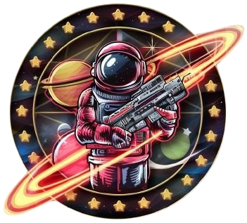

# Construmix

O produto proposto é App que busca resolver os problemas de gestão de estoque e controle de vendas de uma loja de materiais de construção. Atualmente, o cliente utiliza planilhas excel para fazer o controle do estoque da loja, o que, além de não garantir a  integridade dos dados, também consome muito tempo e esforço. O público alvo do DataMix serão os funcionários da loja de construção CONSTRUMIX. Nossa aplicação busca automatizar o controle do estoque dos produtos e fornecer uma informação detalhada do fluxo de caixa da loja.

    

## Equipe

    

        <a href="https://github.com/rabelzx">
                
                <h5 class="text-center">Eric Rabelo</h5>
        </a>
    

    

        <a href="https://github.com/paulomh">
                
                <h5 class="text-center">Paulo Henrique</h5>
        </a>
    

    

        <a href="https://github.com/WolffStein">
                
                <h5 class="text-center">Wolfgang Stein</h5>
        </a>
    

    

        <a href="https://github.com/Carlos-kadu">
                
                <h5 class="text-center">Carlos Eduardo</h5>
        </a>
    

    

        <a href="https://github.com/juliatakaki">
                
                <h5 class="text-center">Julia Takaki</h5>
        </a>
    

    

        <a href="https://github.com/samarawwleticia">
                
                <h5 class="text-center">Samara Leticia</h5>
        </a>
    

    

        <a href="https://github.com/Sunamit">
                
                <h5 class="text-center">Sunamita Vitoria</h5>
        </a>
    

    

---

<h1 style="text-align: center;"><b>DataDiggers</b></h1>
<link rel="stylesheet" href="css/style.css" crossorigin="anonymous">

## História e personagens

    

        

            

                Em uma jornada audaciosa pelo cosmos, a equipe de exploradores espaciais DataDiggers se aventurou em busca das misteriosas tumbas piramidais
                (Query) de um planeta distante. Contudo, sua expedição logo se tornou uma luta desesperada pela sobrevivência quando um encontro inesperado com uma
                tecnologia antiga resultou em uma infecção devastadora. Enquanto exploravam uma dessas tumbas, os DataDiggers encontraram artefatos contendo nanorrobôs adormecidos há milênios. Inadvertidamente, ao perturbarem esses artefatos, liberaram uma nuvem de nanorrobôs que infectaram cada membro da equipe, reprogramando seus corpos e mentes em um nível fundamental.
            

        

        

            
            

Brasão da facção.

        

    

    

        À medida que os dias passavam, os membros da equipe começaram a notar
        mudanças alarmantes em seus corpos. Suas células eram reconfiguradas lentamente pelos nanorrobôs, fundindo tecnologia e biologia de maneiras
        estranhas e imprevisíveis. Novas habilidades surgiam, mas também surgiam efeitos colaterais indesejados, ameaçando a própria essência de sua
        humanidade. Agora, os Datadiggers viajam pela galáxia em busca de uma cura para a infecção que os consome. Em cada planeta visitado, procuram por
        artefatos, conhecimentos antigos ou aliados poderosos que possam oferecer uma solução para seu dilema. Cada sistema estelar explorado é uma corrida
        contra o tempo, pois os efeitos da infecção só se intensificam com o passar dos dias.
    

---

    

        

            <h2>Robô Explorador de Query 01</h2>
            

                REQ1 cresceu em um planeta na galáxia de Calamum Caerulium ouvindo as emocionantes histórias de exploração de seus pais, enquanto a galáxia
                enfrentava turbulências causadas por corporações vorazes e conflitos como os promovidos pelo grupo Apache. Determinado a entender a desordem
                galáctica, REQ1 explorou ruínas antigas em seu planeta, mas sem respostas satisfatórias. Inspirado pelos pais, fundou a facção Data Diggers para
                explorar a galáxia em busca de mais ruínas e respostas, especialmente com os conflitos se intensificando em Calamum Caerulium.
            

        

        

            
        

    

--- 

    

        

            <h2>Robô Explorador de Query 02</h2>
            

                REQ 2 cresceu em uma pequena colônia no limite da galáxia, onde a vida era dura e os recursos escassos. Desde jovem, ela sonhava em escapar da
                monotonia da vida na colônia e explorar os vastos cosmos além. Seu desejo de aventura foi finalmente realizado quando uma equipe de exploradores,
                os DataDiggers, visitou sua colônia em busca de novos recrutas. Inspirada pelo espírito destemido dos exploradores e pelo desejo de descobrir novos
                mundos, ela se juntou à equipe, ansiosa para começar sua própria jornada. Para REQ 2, a vida como uma exploradora era mais do que apenas uma
                aventura; era uma chance de descobrir seu verdadeiro potencial e fazer a diferença no universo.
            

        

        

            
        

    

---

    

        

            <h2>Robô Explorador de Query 03</h2>
            

                Nascido de Nômades, REQ3 sempre viajou em seu planeta conhecendo novas culturas, locais e culinarias diferentes, sempre atento as estrelas e
                sonhando em desbravar diversos mundos e suas peculiaridades, estudou sobre sistemas de navegação estelar e se juntou ao grupo DataDiggers como
                navegador para poder experienciar mais do que esse vasto universo tem a oferecer. 
            

        

        

            
        

    

---

    

        

            <h2>Robô Explorador de Query 04</h2>
            

                Diante da exploração desenfreada das corporações espaciais, várias famílias foram forçadas a fugir em naves desesperadas por escapar do caos que
                engolia seu lar. Entre os inúmeros fugitivos estava REQ4, cuja família desapareceu misteriosamente durante a fuga. Adotado por uma família de
                cientistas desbravadores e crescendo em meio a experimentos e expedições intergalácticas, REQ4 absorveu o espírito aventureiro, assim, decide se
                juntar ao grupo de exploradores conhecido como Datadiggers. Determinado a encontrar pistas sobre o que aconteceu com sua família, REQ4 embarca em
                uma jornada repleta de perigos e mistérios.
            

        

        

            
        

    

---

    

        

            <h2>Robô Explorador de Query 05</h2>
            

                REQ 5 era uma engenheira que vivia pacificamente com sua família até a invasão da Corporação Spark Tech, que devastou sua aldeia e deixou seu povo
                completamente desolado. Determinada a resistir, REQ 5 se juntou a um grupo de exploradores interestelares, viajando entre os planetas em busca de
                recursos para ajudar os seus irmãos a se reerguerem e procurando incessantemente pelos entes queridos que desapareceram durante o ataque. Ela
                persiste na esperança de um dia reunir sua família e restaurar a liberdade de sua comunidade.
            

        

        

            
        

    

---

    

        

            <h2>Robô Explorador de Query 06</h2>
            

                REQ6, fascinada pelo cosmos desde jovem, se torna uma engenheira espacial talentosa. Durante sua primeira missão, enfrenta uma série de desafios,
                incluindo uma tempestade de detritos cósmicos, mas com determinação e coragem, consegue retornar à segurança de sua casa. Sua jornada épica a torna
                uma lenda entre os exploradores do espaço, inspirando futuras gerações a sonhar com as estrelas.
            

        

        

            
        

    

---

    

        

            <h2>Robô Explorador de Query 07</h2>
            

                Um jovem órfão que vivia à margem da lei, sobrevivendo como podia em meio ao caos da galáxia deixado pelas corporações gananciosas. Sua vida mudou
                drasticamente quando foi recrutado por REQ1, líder da equipe Datta Diggers. Apesar de suas origens como fora da lei, demonstrou habilidades únicas
                e uma determinação inabalável, tornando-se rapidamente um membro valioso da equipe.
            

        

        

            
        

    

